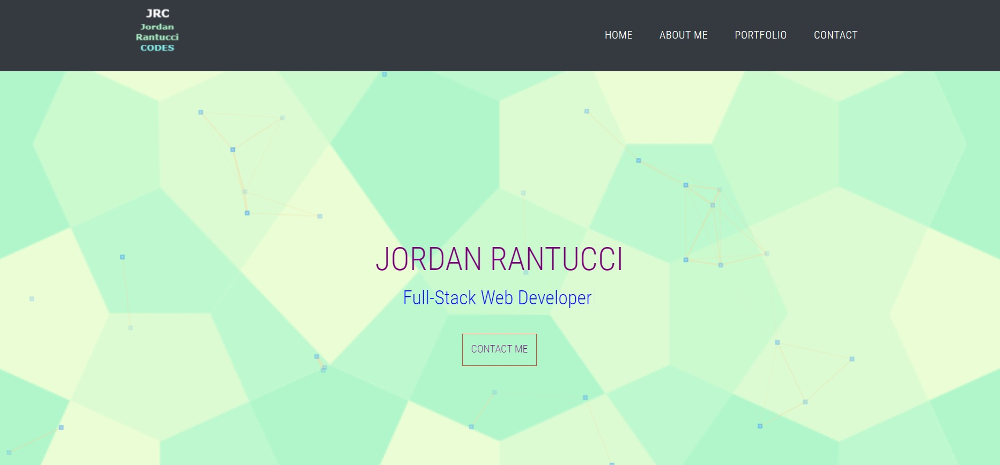

# React Portfolio

## Description 

This is a CWRU coding bootcamp homework assignment practicing using React.  The application's UI is divided into several components that have managed states.  They are able to responde to the user events of filtering and sorting.

AS A USER I would like an application that is an employee directory that can quickly acces information on a list of personnel.  The User can view the entire directory and be able to filter by first or last name and sort first name alphabetically.

## Table of Contents

* [Installation](#installation)

* [Usage](#usage)

* [Contributions](#contributions)

* [Tests](#tests)

* [License](#license)

* [Questions](#questions)

* [Future](#future)

* [Contact](#contact)

## Installation
If running application locally, this requires "npm i" in the command terminal to install dependencies.  

## Usage
The project is used for observing an employee directory: https://jordanrantucci.github.io/Portfolio_React/

Locally you can run by using "npm start"

Deployed Site

## Contributions
Jordan Rantucci

## Tests
There are no test procedures for this application.

## License 
none

# Questions
See Contact Section

# Future
In the future I would like to be able to sort by each column and search by city and state as well.

# Contact

GitHub username: jordanrantucci and Email address: jordanrantucci@gmail.com

